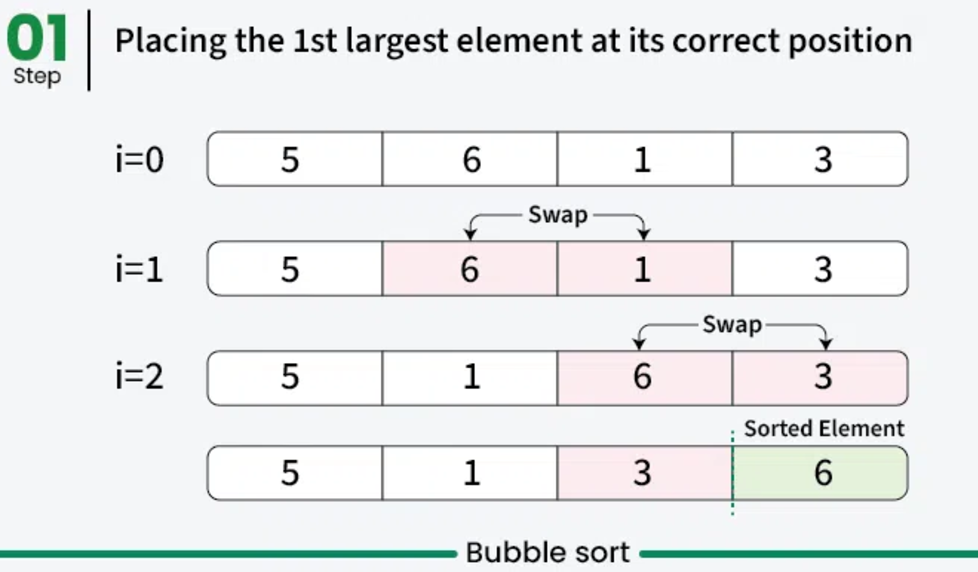
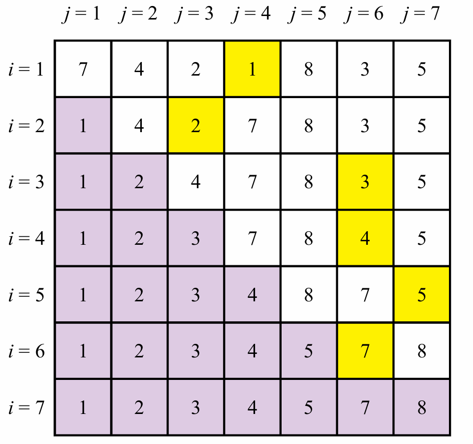
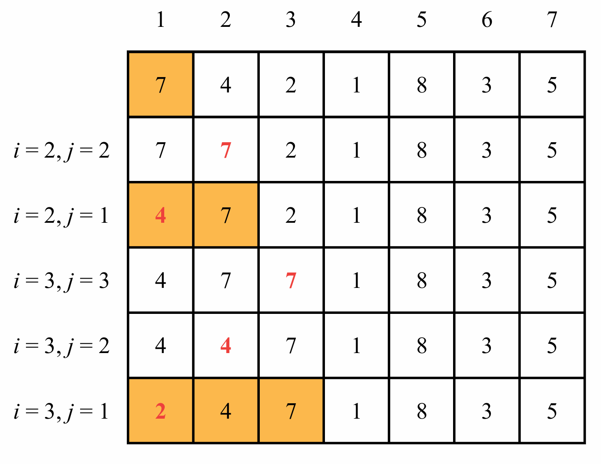
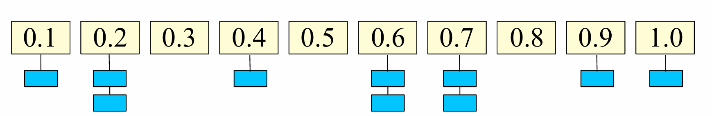

# Sorting && Time complexity

Basato su [Competitive Programmer's Handbook](https://github.com/Marrocco-Simone/palestradialgoritmi/blob/master/risorse/Competitive_Programmer%E2%80%99s_Handbook.pdf), [Dispense del prof. Bugatti](https://github.com/Marrocco-Simone/palestradialgoritmi/blob/master/risorse/Dispense_prof_Bugatti.pdf) e [Halim's Competitive Programming 3](https://github.com/Marrocco-Simone/palestradialgoritmi/blob/master/risorse/competitive_programming_3_1.pdf)

---

### Complessità computazionale

Quando parliamo di efficienza come facciamo a capire quando un algoritmo è migliore rispetto a un altro?

---

### Complessità computazionale

Quando parliamo di efficienza come facciamo a capire quando un algoritmo è migliore rispetto a un altro?
Si calcola una stima di costo dell'algoritmo.

- costo = tempo di esecuzione

Esempio

- Supponiamo che la dichiarazione, assegnazione e qualsiasi operazione su una variabile costi 1

---

### Complessità computazionale

Esempio: supponiamo che

- inserire valore da input
- istruzione di confronto
- operazioni matematiche

abbiano tutte costo 1

---

```python
N = 100                    # costo 1
a = 5                      # costo 1
for i in range(1, N):      # costo ?
    a = a + a              # costo 1
return a
```

**Soluzione:**

- Assegnazioni: 2 operazioni = 2
- Ciclo for eseguito (N-1) volte, ogni iterazione costa 1
- Totale: 2 + (N-1) = N + 1
- Per N grande: **O(N)**

---

### Esempio con cicli annidati

```python
a = int(input())           # costo 1
b = 0                      # costo 1
for i in range(N):         # eseguito N volte
    if a > 5:              # costo 1
        b = b + i          # costo 1
        a -= 1             # costo 1
    else:
        for j in range(N):  # eseguito N volte
            b = b + j       # costo 1
```

**Soluzione (caso peggiore):**

- Se a ≤ 5 inizialmente, entriamo sempre nell'else
- Ciclo esterno: N iterazioni
- Ciclo interno: N iterazioni per ogni iterazione esterna
- Totale: 1 + 1 + N × (1 + N × 1) = 2 + N + N² = N² + N + 2
- Per N grande: **O(N²)**

---

### Notazione O(n)

Per calcolare la complessità dobbiamo:

- analizzare il caso peggiore
- valutare il costo per un N molto grande

Quando N è molto grande possiamo "dimenticarci" degli altri termini. A questo punto la complessità può essere approssimata a delle "famiglie" di funzioni. Indichiamo queste con la notazione di "O grande":

O(1) - O(logN) - O(N) - O(NlogN) - O(N^2) - O(2^N)

---


---

### Algoritmi di sorting

Affronteremo ora il problema di riordinamento di un array. Ci eserciteremo a scrivere questi algoritmi e a cercare l'algoritmo più efficiente.

---

### Random sort

Approccio "particolare"

- **Generiamo tutte le possibili permutazioni fino a quando non ne troviamo una già ordinata.**

Un'analogia è quella di ordinare un mazzo di carte lanciandolo in aria, raccogliendo le carte a caso e ripetendo il processo fino a quando il mazzo non è ordinato.
Appare quasi impossibile trovare l'ordine giusto senza generare ripetutamente permutazioni sbagliate.

---

### Random sort && Pseudo-codice

```python
while not is_sorted(deck):
    shuffle(deck)
```

---

### Random sort && Codice completo

```python
import random

def is_sorted(arr):
    """Verifica se l'array è ordinato"""
    for i in range(len(arr) - 1):
        if arr[i] > arr[i + 1]:
            return False
    return True

def random_sort(arr):
    """
    Bogo sort: mescola l'array finché non è ordinato
    ATTENZIONE: estremamente inefficiente!
    """
    while not is_sorted(arr):
        random.shuffle(arr)
```

<br>

Source: [https://en.wikipedia.org/wiki/Bogosort](https://en.wikipedia.org/wiki/Bogosort)

---

### Random sort && Complessità?

Caso peggiore: non c'è limite superiore pratico perché l'algoritmo potrebbe generare sempre le stesse permutazioni sbagliate.

Formalmente, nel caso peggiore, la **complessità è 𝑂(𝑛⋅𝑛!)**.

Questo perché, nel caso peggiore, dobbiamo **controllare tutte le possibilità** con _shuffle()_ (che sono **𝑛!**) e per ognuna **verificare se è ordinata** con _is_sorted()_ (con costo **𝑛**).

---

### Bubble Sort && Idea

**Strategia: "Fai emergere il più grande come una bolla"**

- Confronta ogni coppia di elementi adiacenti
- Se sono nell'ordine sbagliato, scambiali
- Ripeti finché non ci sono più scambi da fare



Source: [https://www.geeksforgeeks.org/bubble-sort-algorithm/](https://www.geeksforgeeks.org/bubble-sort-algorithm/)

---

### Bubble Sort && Pseudo-Codice

**Regola base:** Se elemento[x] > elemento[x+1], scambiali ("swap")

```python
def bubble_sort(arr):  # O(n)*O(n) -> O(n^2)
    n = len(arr)
    for i in range(n):  # O(n)
        for j in range(n-1):  # O(n-1)
            if arr[j] > arr[j+1]:  # confronta elementi adiacenti
                arr[j], arr[j+1] = arr[j+1], arr[j]  # O(1)
```

<br/>

Questo algoritmo ha complessità **_O(n^2)_**.

---

### Bubble Sort && Codice Ottimizzato

```python
def bubble_sort_ottimizzato(arr):  # O(n^2) caso peggiore, O(n) caso migliore
    n = len(arr)
    for i in range(n):  # O(n)
        swapped = False
        for j in range(n-i-1):  # O(n-i)
            if arr[j] > arr[j+1]:
                arr[j], arr[j+1] = arr[j+1], arr[j]
                swapped = True
        if not swapped:  # se non ci sono stati scambi, l'array è ordinato
            break
```

<br/>

Questo algoritmo ha **la stessa complessità _O(n^2)_** nel caso peggiore, **ma O(n) nel caso migliore** (array già ordinato).

---

### Selection Sort && Idea

**Strategia: "Trova il minimo e mettilo al suo posto"**

- Per ogni posizione `i`, cerca il minimo tra gli elementi rimanenti `[i, fine]`
- Scambia l'elemento in posizione `i` con il minimo trovato
- Ripeti per tutte le posizioni



---

### Selection Sort && Codice

```python
def selection_sort(array):  # O(n)*O(n) -> O(n^2)
    for i in range(len(array)):  # O(n)
        # trova minimo tra [i, fine], O(n)
        min_idx = i
        for j in range(i+1, len(array)):
            if array[j] < array[min_idx]:
                min_idx = j

        # scambia (i <-> min), O(1)
        array[i], array[min_idx] = array[min_idx], array[i]
```

---

### Selection Sort && Complessità

La complessità è **sempre _O(n^2)_** in ogni caso (migliore, medio, peggiore).

**Perché?**

- Eseguiamo **sempre** i cicli for completi
- Cerchiamo **sempre** il minimo tra tutti gli elementi rimanenti
- **Non ci sono ottimizzazioni possibili**, anche se l'array è già ordinato

**Numero di confronti:** n(n-1)/2 ≈ n²/2 → O(n²)

---

### Insertion Sort && Idea

**Strategia: "Inserisci ogni elemento nella posizione corretta"**

Come ordinare una mano di carte (scala quaranta):

- Manteniamo una parte "ordinata" dell'array (inizialmente solo il primo elemento)
- Per ogni nuovo elemento, lo inseriamo nella posizione corretta nella parte ordinata
- Spostiamo gli elementi maggiori verso destra per fare spazio

---

### Insertion Sort && Codice

```python
def insertion_sort(A):  # pessimo: O(n^2), se già ordinato O(n)
    n = len(A)
    for i in range(1, n):  # O(n)
        tmp = A[i]
        j = i
        while j > 0 and A[j-1] > tmp:  # AL PIU' O(n), PUO' non eseguirsi
            A[j] = A[j-1]
            j -= 1
        A[j] = tmp
```

---

### Insertion Sort && suo esempio



---

### Insertion Sort && Complessità

**Caso peggiore:** O(n²) - array ordinato al contrario
**Caso migliore:** O(n) - array già ordinato!

**Perché è più efficiente di Selection Sort?**

- Il ciclo `while` interno **può non eseguirsi** se l'elemento è già nella posizione corretta
- Se l'array è già ordinato, il while non viene mai eseguito → O(n)
- Molto efficiente per array quasi ordinati

---

### Ricorsione

Per migliorare l'efficienza dei nostri algoritmi ci viene in aiuto un importante strumento: la ricorsione!
Ma attenzione a usarla correttamente: bisogna stare attenti a non creare un loop infinito e verificare sempre il caso base.

```python
def function(a):
    if caso_base:
        ...
    else:
        ...
        function(b)
```

---

### Esempio di ricorsione: fattoriale

```python
def fattoriale(n):
    if n == 0:
        return 1
    else:
        return n * fattoriale(n-1)
```

---

### Merge Sort && Idea

**Strategia: "Dividi e Conquista"**

1. **Dividi:** Spezza l'array in due metà
2. **Conquista:** Ordina ricorsivamente ciascuna metà
3. **Combina:** Unisci le due metà ordinate in un unico array ordinato

**Caso base:** Un array di 1 elemento è già ordinato!

---

### Merge Sort && Visualizzazione


---

### Merge sort && Codice

```python
def merge(arr, left, mid, right):
    # Crea due array temporanei
    left_array = arr[left:mid+1]
    right_array = arr[mid+1:right+1]

    i = j = 0  # indici per left_array e right_array
    k = left   # indice per array originale

    # Confronta e unisci
    while i < len(left_array) and j < len(right_array):
        if left_array[i] <= right_array[j]:
            arr[k] = left_array[i]
            i += 1
        else:
            arr[k] = right_array[j]
            j += 1
        k += 1

    # Copia gli elementi rimanenti di left_array
    while i < len(left_array):
        arr[k] = left_array[i]
        i += 1
        k += 1

    # Copia gli elementi rimanenti di right_array
    while j < len(right_array):
        arr[k] = right_array[j]
        j += 1
        k += 1

def merge_sort(arr, left, right):
    if left < right:
        mid = (left + right) // 2

        # Ordina ricorsivamente le due metà
        merge_sort(arr, left, mid)
        merge_sort(arr, mid + 1, right)

        # Unisci le due metà ordinate
        merge(arr, left, mid, right)

# Utilizzo: merge_sort(array, 0, len(array)-1)
```

---

### Merge Sort && Complessità

**Analisi:**

1. **Costo di merge():** O(n) - dobbiamo scorrere tutti gli elementi
2. **Numero di livelli:** log n - ogni volta dividiamo per 2
3. **Costo per livello:** O(n) - merge di tutti i sotto-array

**Formula ricorsiva:**

- T(1) = O(1) → array di 1 elemento
- T(n) = 2T(n/2) + O(n) → dividi in 2 + merge

**Risultato (Master Theorem):** O(n log n) ✅

**Sempre efficiente:** O(n log n) in ogni caso (migliore, medio, peggiore)

---

### Merge Sort

Versione iterativa (versione bottom-up):


---

### Merge Sort iterativo

**Idea:**
Partiamo dal fondo di un array con dimensione unitaria (quindi per definizione è già ordinato) e poi usiamo gli indici per dividere l'array e specificare quale parte dell'array riordinare.

```python
def merge_sort_iterativo(arr):
    n = len(arr)
    # Inizia con blocchi di dimensione 1, poi 2, 4, 8, ...
    current_size = 1

    while current_size < n:
        # Seleziona il punto di inizio del sottovettore sinistro da unire
        left_start = 0

        while left_start < n:
            # Trova il punto finale del sottovettore sinistro
            left_end = min(left_start + current_size - 1, n - 1)

            # Trova il punto finale del sottovettore destro
            right_end = min(left_start + current_size * 2 - 1, n - 1)

            # Unisci i sottovettori arr[left_start...left_end] e
            # arr[left_end+1...right_end]
            if left_end < right_end:
                merge(arr, left_start, left_end, right_end)

            left_start += current_size * 2

        # Aumenta la dimensione del blocco per la prossima iterazione
        current_size *= 2

# Riusa la funzione merge definita prima
```

<!-- ---

### Bucket Sort

**Ipotesi sull'input**
Valori reali **uniformemente distribuiti** nell'intervallo [0,1).
Qualunque insieme di valori distribuiti uniformemente può essere normalizzato nell'intervallo [0,1) in tempo lineare.

**Idea**
**Dividere l'intervallo in _n_** sottointervalli di dimensione 1/n, detti bucket, e poi **distribuire gli n numeri nei bucket**.
Per l'ipotesi di uniformità, il numero atteso di valori nei bucket è 1. Possono essere ordinati con Insertion Sort o altri algoritmi (stabili).

---

### Bucket Sort && Idea Generale



- Impostiamo un array di "bucket" inizialmente vuoti.
- Esaminiamo l'array originale, inserendo ogni oggetto nel suo bucket (tipo _array[i] = bucket[n\*array[i]]_ ).
- Ordiniamo ogni bucket non vuoto (con, ad esempio, Selection Sort).
- Visitiamo i bucket in ordine e rimettiamo tutti gli elementi nell'array originale tramite concatenazione.

---

### Bucket Sort && Idea Dettagliata

1. Creiamo un _array-bucket_ con _10_ celle (k), per avere l'uniformità;
2. Inseriamo ogni elemento dell'array iniziale nella cella più **_simile_** in _array-bucket_ (es: `0.23\*10 -> 2`);
3. Applichiamo un algoritmo efficiente di sorting in ogni _sub_bucket_;
4. Concateniamo ogni _sub_bucket_ nell'array originale

---

### Bucket Sort && Pseudo-Codice

```python
def bucket_sort(array, k):
    buckets = [[] for _ in range(k)]
    M = 1 + max(array)

    for elem in array:
        bucket_index = int(k * elem / M)
        buckets[bucket_index].append(elem)

    for i in range(k):
        buckets[i].sort()  # o usa insertion_sort

    return [elem for bucket in buckets for elem in bucket]
```

Source: [https://www.geeksforgeeks.org/bucket-sort-2/](https://www.geeksforgeeks.org/bucket-sort-2/)
[https://en.wikipedia.org/wiki/Bucket_sort](https://en.wikipedia.org/wiki/Bucket_sort)

---

### Bucket Sort && Codice

```python
def bucket_sort(input_list):
    num_in_bucket = 10  # il "k", necessario per garantire uniformità
    bucket = [[] for _ in range(num_in_bucket)]  # matrice "lunga k", O(k)
    M = 1 + max(input_list)  # O(n)

    for elem in input_list:  # O(1 + 1)*n -> O(n)
        index = int(num_in_bucket * elem / M)  # hashing func, O(1)
        bucket[index].append(elem)  # inserimento elem nel bucket simile, O(1)

    for i in range(num_in_bucket):  # ordinamento di ogni sub-vector, O(k)
        selection_sort(bucket[i])  # meglio insertion_sort per pochi elementi
        # altrimenti O(W^2) con "W"=n/k grazie alla distribuzione uniforme
        # quindi O(W^2) -> O((n/k)^2)
    # quindi il tutto è O(k)*O((n/k)^2) -> O(n^2 / k), se k è costante allora ho O(n^2)

    input_list.clear()  # elimina tutti gli elementi
    for i in range(num_in_bucket):  # concatenazione, O(k)
        for num in bucket[i]:  # O(n/k)
            input_list.append(num)  # O(1)
    # quindi il tutto è: O(k)*O(n/k) -> O(n)
# In conclusione: O(n) + O(n^2) + O(n) = O(n^2) nel caso pessimo
```

---

### Bucket Sort && Complessità

Considerando (come sempre si deve fare) il **caso peggiore** la complessità è _O(n^2)_.
Si verifica quando un bucket ottiene tutti gli elementi.
In questo caso, eseguiremo l'ordinamento per inserimento su tutti gli elementi, il che renderà la complessità temporale pari a **_O(n^2)_ SE usiamo _selection_sort()_**.

Possiamo ridurre la complessità temporale del caso peggiore a _O(n\*log n)_ utilizzando un algoritmo _O(n\*log n)_ come Merge Sort.

**Di solito il caso medio è _O(n + k)_** se usiamo _insertion_sort()_ e ogni bucket ha lo stesso numero di elementi.

---

### Esempio pratico di testing

Per testare e confrontare le prestazioni dei vari algoritmi di ordinamento, è disponibile un template in Python:

**File: `2.complexity_and_sorting/sorting.py`**

Questo file contiene:

- Generazione di array casuali di dimensione variabile
- Misurazione dei tempi di esecuzione
- Verifica della correttezza dell'ordinamento
- Template per implementare e testare i vostri algoritmi

Potete implementare i diversi algoritmi di sorting nella funzione `ordina()` e confrontare i tempi di esecuzione per array di dimensioni diverse.

--- -->

### Riepilogo complessità

| Algoritmo      | Caso Migliore | Caso Medio | Caso Peggiore | Spazio | Caratteristiche            |
| -------------- | ------------- | ---------- | ------------- | ------ | -------------------------- |
| Random Sort    | O(n)          | O(n·n!)    | ∞             | O(1)   | ❌ Mai usare               |
| Bubble Sort    | O(n)          | O(n²)      | O(n²)         | O(1)   | ⚠️ Lento                   |
| Selection Sort | O(n²)         | O(n²)      | O(n²)         | O(1)   | ❌ Non ottimizzabile       |
| Insertion Sort | O(n)          | O(n²)      | O(n²)         | O(1)   | ✅ Buono se quasi ordinato |
| Merge Sort     | O(n log n)    | O(n log n) | O(n log n)    | O(n)   | ✅ Sempre efficiente       |
