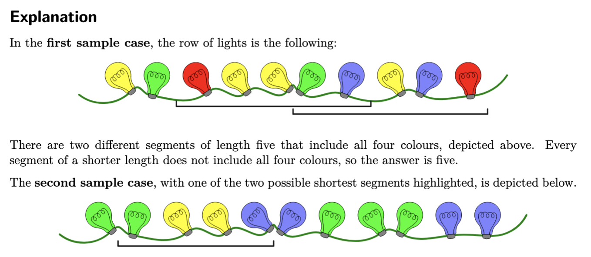

# Greedy Algorithms

Basato su [Competitive Programmer's Handbook](https://github.com/Marrocco-Simone/palestradialgoritmi/blob/master/risorse/Competitive%20Programmer%E2%80%99s%20Handbook.pdf), [Dispense del prof. Bugatti](https://github.com/Marrocco-Simone/palestradialgoritmi/blob/master/risorse/Dispense%20prof%20Bugatti.pdf) e [Halim's Competitive Programming 3](https://github.com/Marrocco-Simone/palestradialgoritmi/blob/master/risorse/competitive%20programming%203_1.pdf)

---

# Esercitarsi

Il segreto per diventare bravi? Tanti esercizi!

[Potete trovarne tanti qui!](https://training.olinfo.it/tasks/1?tag=greedy&order=easiest)

---

# Coin Change

[https://training.olinfo.it/task/ois_coinchange](https://training.olinfo.it/task/ois_coinchange)

Abbiamo tante monete e banconote con valori diversi. Vogliamo darli ad una macchina che ci ritornerà lo stesso valore, ma con il numero minore di banconote

---

# Osservazione

Cosa cambia nella nostra soluzione, se abbiamo 1x200 & 4x5, rispetto a 2x100 & 1x20?

Contano le monete finali, o solamente il totale che ho (420)?

---

# Osservazione

Devo avere per forza le monete salvate come float? Usarli crea problemi di arrotondamento!

Cosa succede se invece di contare gli euro, conto i centesimi?

---

# Semplificazione

```c++
long long monete[15] = {
	1, 2, 5, 10, 20, 50, 100, 200, 500,
	1000, 2000, 5000, 10000, 20000, 50000
};
long long totale = 0;
for (int i = 0; i < 15; i++) {
	totale += monete[i] * V[i];
}
```

---

# Soluzione

Prendo quante piu' posso dalla moneta piu' grande, poi passo alla prossima con il resto rimanente

```c++
for (int i = 14; i >= 0; i--) {
	sol[i] = totale / monete[i];
	totale = totale % monete[i];
}
```

---

# Christmas Lights

[https://training.olinfo.it/task/ois_lights](https://training.olinfo.it/task/ois_lights)

Data un array lungo N di colori, numerati da 1 a C, trovare la lunghezza di un segmento che li contiene tutti piu' piccola possibile.

---

# Christmas Lights



---

# Idea veloce

Mentre un compagno di squadra pensa ad una soluzione ottimale, noi scriviamone una semplice e velocemente: provale tutte!

Soluzioni dove proviamo ogni soluzione possibile sono lente, ma danno comunque qualche punto!

Questo tipo di soluzione viene chiamato _brute force_.

---

# Brute Force

```c++
for (int c = 0; c <= N; c++) // lunghezza del segmento, almeno C
	for (int start = 0; start < N - c; start++){
		vector<bool> trovati(C, false);
		for (int j = start; j < start + c; j++)
			trovati[L[j]] = true;

		bool trovati_tutti = true;
		for (int j = 0; j < C; j++)
			if (!trovati[j]) trovati_tutti = false;
		if (trovati_tutti) {
			cout << c << endl; // print the result
			return 0;
		}
	}
```

---

# Idea migliore

Questa soluzione chiaramente guarda troppe casistiche e ci mette troppo tempo.

Un'idea possibile e': scorro l'array dalla partenza finche' non trovo un colore che non esiste piu' dopo: poiche' mi servono tutti i colori, questo sara' l'inizio del mio segmento.

Una volta trovato l'inizio, faccio lo stesso partendo dalla fine per trovare la fine del mio segmento.

---

```c++
int start_1 = 0;
int end_1 = N - 1;
bool trovato_start_1 = true;

while (trovato_start_1) {
	trovato_start_1 = false;
	for (int j = start_1 + 1; j <= end_1; j++) {
		if (L[j] == L[start_1]) {
			trovato_start_1 = true;
			start_1++;
			break;
		}
	}
}
```

---

```c++
bool trovato_end_1 = true;
while (trovato_end_1) {
	trovato_end_1 = false;
	for (int j = end_1 - 1; j >= start_1; j--) {
		if (L[j] == L[end_1]) {
			trovato_end_1 = true;
			end_1--;
			break;
		}
	}
}

int sol_1 = end_1 - start_1 + 1;
```

---

# Bastera'?

Cosa mi assicura che la strategia sia partire dall'inizio e poi trovare la fine, e non il contrario?

Applico due volte quest'idea, solo che prima faccio il ciclo dalla fine e poi dall'inizio.

---

# Miglioriamo il controllo dei colori

Per controllare i colori, tuttavia, controllo sempre tutto l'array rimanente.

Un'idea migliore potrebbe essere contare tutti i colori presenti nel mio segmento: se un colore e' presente piu' di una volta, posso eliminarlo

---

```c++
int start_1 = 0;
int end_1 = N - 1;
int counter_1[C];
for (int c = 0; c < C; c++) {
	counter_1[c] = 0;
	counter_2[c] = 0;
}
for (int i = 0; i < N; i++) {
	counter_1[L[i]]++;
	counter_2[L[i]]++;
}
```

---

```c++
while (true) {
	if (counter_1[L[start_1]] > 1) {
		counter_1[L[start_1]]--;
		start_1++;
	} else break;
}

while (true) {
	if (counter_1[L[end_1]] > 1) {
		counter_1[L[end_1]]--;
		end_1--;
	} else break;
}

int sol_1 = end_1 - start_1 + 1;
```
