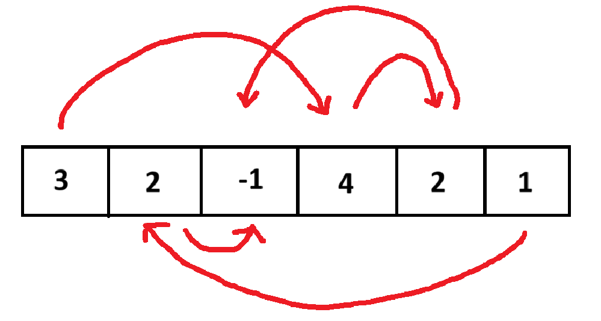

# Greedy Algorithms

Basato su [Competitive Programmer's Handbook](https://github.com/Marrocco-Simone/palestradialgoritmi/blob/master/risorse/Competitive%20Programmer%E2%80%99s%20Handbook.pdf), [Dispense del prof. Bugatti](https://github.com/Marrocco-Simone/palestradialgoritmi/blob/master/risorse/Dispense%20prof%20Bugatti.pdf) e [Halim's Competitive Programming 3](https://github.com/Marrocco-Simone/palestradialgoritmi/blob/master/risorse/competitive%20programming%203_1.pdf)

---

# Esercitarsi

Il segreto per diventare bravi? Tanti esercizi!

[Potete trovarne tanti qui!](https://training.olinfo.it/tasks/1?tag=greedy&order=easiest)

---

# Coin Change

[https://training.olinfo.it/task/ois_coinchange](https://training.olinfo.it/task/ois_coinchange)

Abbiamo tante monete e banconote con valori diversi. Vogliamo darli ad una macchina che ci ritornerà lo stesso valore, ma con il numero minore di banconote

---

# Osservazione

Cosa cambia nella nostra soluzione, se abbiamo 1x200 & 4x5, rispetto a 2x100 & 1x20?

Contano le monete finali, o solamente il totale che ho (420)?

---

# Osservazione

Devo avere per forza le monete salvate come float? Usarli crea problemi di arrotondamento!

Cosa succede se invece di contare gli euro, conto i centesimi?

---

# Semplificazione

```c++
long long monete[15] = {
	1, 2, 5, 10, 20, 50, 100, 200, 500,
	1000, 2000, 5000, 10000, 20000, 50000
};
long long totale = 0;
for (int i = 0; i < 15; i++) {
	totale += monete[i] * V[i];
}
```

---

# Soluzione

Prendo quante piu' posso dalla moneta piu' grande, poi passo alla prossima con il resto rimanente

```c++
for (int i = 14; i >= 0; i--) {
	sol[i] = totale / monete[i];
	totale = totale % monete[i];
}
```

---

# Christmas Lights

[https://training.olinfo.it/task/ois_lights](https://training.olinfo.it/task/ois_lights)

Data un array lungo N di colori, numerati da 1 a C, trovare la lunghezza di un segmento che li contiene tutti piu' piccola possibile.

---

# Christmas Lights


---

# Idea veloce

Mentre un compagno di squadra pensa ad una soluzione ottimale, noi scriviamone una semplice e velocemente: provale tutte!

Soluzioni dove proviamo ogni soluzione possibile sono lente, ma danno comunque qualche punto!

Questo tipo di soluzione viene chiamato _brute force_.

---

# Brute Force

```c++
for (int c = 0; c <= N; c++) // lunghezza del segmento, almeno C
	for (int start = 0; start < N - c; start++){
		vector<bool> trovati(C, false);
		for (int j = start; j < start + c; j++)
			trovati[L[j]] = true;

		bool trovati_tutti = true;
		for (int j = 0; j < C; j++)
			if (!trovati[j]) trovati_tutti = false;
		if (trovati_tutti) {
			cout << c << endl; // print the result
			return 0;
		}
	}
```

---

# Idea migliore

Questa soluzione chiaramente guarda troppe casistiche e ci mette troppo tempo.

Un'idea possibile e': scorro l'array dalla partenza finche' non trovo un colore che non esiste piu' dopo: poiche' mi servono tutti i colori, questo sara' l'inizio del mio segmento.

Una volta trovato l'inizio, faccio lo stesso partendo dalla fine per trovare la fine del mio segmento.

---

```c++
int start_1 = 0;
int end_1 = N - 1;
bool trovato_start_1 = true;

while (trovato_start_1) {
	trovato_start_1 = false;
	for (int j = start_1 + 1; j <= end_1; j++) {
		if (L[j] == L[start_1]) {
			trovato_start_1 = true;
			start_1++;
			break;
		}
	}
}
```

---

```c++
bool trovato_end_1 = true;
while (trovato_end_1) {
	trovato_end_1 = false;
	for (int j = end_1 - 1; j >= start_1; j--) {
		if (L[j] == L[end_1]) {
			trovato_end_1 = true;
			end_1--;
			break;
		}
	}
}

int sol_1 = end_1 - start_1 + 1;
```

---

# Bastera'?

Cosa mi assicura che la strategia sia partire dall'inizio e poi trovare la fine, e non il contrario?

Applico due volte quest'idea, solo che prima faccio il ciclo dalla fine e poi dall'inizio.

---

# Miglioriamo il controllo dei colori

Per controllare i colori, tuttavia, controllo sempre tutto l'array rimanente.

Un'idea migliore potrebbe essere contare tutti i colori presenti nel mio segmento: se un colore e' presente piu' di una volta, posso eliminarlo

---

```c++
int start_1 = 0;
int end_1 = N - 1;
int counter_1[C];
for (int c = 0; c < C; c++) {
	counter_1[c] = 0;
	counter_2[c] = 0;
}
for (int i = 0; i < N; i++) {
	counter_1[L[i]]++;
	counter_2[L[i]]++;
}
```

---

```c++
while (true) {
	if (counter_1[L[start_1]] > 1) {
		counter_1[L[start_1]]--;
		start_1++;
	} else break;
}

while (true) {
	if (counter_1[L[end_1]] > 1) {
		counter_1[L[end_1]]--;
		end_1--;
	} else break;
}

int sol_1 = end_1 - start_1 + 1;
```

---

# Precise Average

Il tuo amico John lavora in un negozio che vende _N_ prodotti, numerati da 0 a N-1.
Ogni prodotto di indice _i_, costa _P[i]_ bytedollari, ogni é P[i]>0.
Il governo impone una nuova legge per il negozio.
La legge recita **"la media di tutti i prezzi deve essere esattamente K"**, con K>0.
La capa di John gli chiede di cambiare i prezzi dei prodotti, tale per cui rispettino la nuova legge.

Fonte: [https://training.olinfo.it/task/ois_avg/](https://training.olinfo.it/task/ois_avg/)

---

John è pigro e vuole fare il minimo di cambi possibili:

> qual è il **numero minimo** di cambiamenti che deve effettuare?

**Il prezzo di un prodotto può diventare QUALSIASI prezzo positivo (niente roba gratis)**

---

#### Vincoli (solo IN INPUT --> non vale per output):

• 1 ≤ N ≤ 200 000.
• 1 ≤ K ≤ 1 000 000.
• 1 ≤ Pi ≤ 1 000 000 per ogni i = 0 ... N−1.

### Esempi

| Input        | Output |
| ------------ | ------ |
| K=3; 10, 6   | 2      |
| K=9; 2,10, 1 | 1      |

---

#### Soluzione && Codice

```c++
#define MAXD 1000000*1ULL
typedef unsigned long long ull;

int average(vector<ull>& P, ull sum_prod, ull NK){//O(n * logn) ... perché non O(n)?
    if(sum_prod<NK) return 1;//perché sempre 1?
    else if(sum_prod==NK) return 0;//perche?

    sort(P.rbegin(), P.rend());//decrescente, O(n * logn)?, perché ordinare al contrario?
    ull difference=sum_prod-NK;//a cosa serve?
    int counter_num_changed = 0;//tengo conto di quanti cambiamenti ho fatto

    for (int i = 0; i < P.size() && difference > 0; ++i){//O(n)
	ull maximum_change = (P[i]-1);//a cosa serve?
        ull decrement = min(difference, less_then_Pi);//perché min()
        P[i] = max((P[i] - decrement), 1ULL);//a cosa serve?
        difference -= decrement;//aggiorno la  difference, perché qualcosa l'ho "consumato"
        ++counter_num_changed;
    }
    return counter_num_changed;
}
```

---

### Complessità?

```c++
/*ogni istruzione prima del sort --> O(1)*/
```

```c++
sort(P.rbegin(), P.rend()); //--> O(n * logn)
```

```c++
for (int i = 0; i < P.size(); ++i) //--> O(P.size), ovvero O(n)
```

```c++
/*ogni istruzione dentro il for-loop --> O(1)*/
```

```c++
/*costo finale for-loop: O(n)*O(1)--> O(n*1)--> O(n)*/
```

**Costo finale:** O(n _ logn) + O(n) --> \*\*O(n _ logn)\*\*

---

#### Codice commentato

```c++
if(sum_prod<NK) return 1;//perché sempre 1?
```

Immaginiamo di avere: K=9 e P: 2,10, 1.
Ricordiamo che: **difference = sum_prod - NK**
Allora N=3, K=9 --> NK=27, sum_prod=13 -->
difference=13-27= **-** 14. Ora significa che dobbiamo **aumentare** di 14, ma **possiamo aumentare un qualsiasi prodotto** di 14, visto che il prezzo deve essere almeno positivo **E** perché il **vincolo di massimo 1 milione vale solo per i dati iniziali e non finali**.
Quindi **SEMPRE** serve aumentare un valore a caso, ergo un solo cambiamento.

---

```c++
else if(sum_prod==NK) return 0;//perche?
```

Immaginiamo di avere: K=2 e P: 3,1.
Allora N=2, K=2 --> NK=4, sum_prod=4 --> difference=4-4= 0 --> rispetto già la legge.

Semplice vedere che se la media nostra è già uguale a K, allora rispettiamo già la legge, ergo **NON DEVO fare nulla e quindi zero cambiamenti**.

---

```c++
sort(P.rbegin(), P.rend());//perché ordinare al contrario?
```

Ora stiamo **assumendo che sum_prod > NK**, ergo il nostro valore/media è maggiore di quanto dovrebbe essere per legge.
Quindi devo **_sottrarre_**.
Sia K=3 e P: 10, 6.
Allora N=2, K=3 --> NK=6, sum*prod=16 --> difference=16-6= **+** 10.
Ergo \_dovremmo* **togliere** esattamente 10 e quindi, per intuito greedy, **togliamo il più possibile al numero più grande --> ergo devo sapere quale sia il più grande, perciò ordino e so subito trovare il massimo in O(1) pagando una volta O(n \* logn)**.
Quindi, dopo aver ordinato, tolgo a P[0](ovvero 10) il più possibile di _difference_.

---

```c++
ull difference=sum_prod-NK; //a cosa serve?
```

Se siamo arrivatu fin qui vuol dire che _difference_ è positivo, ovvero (per intenderci), che dobbiamo togliere una parte positiva di prezzo ai nostri prodotti.

Usiamo un **unsigned long long** perché nel caso pessimo avremmo 1'000'000 _ 200'000 - 200'000 _ 1, ovvero 199'999'800'000. Però con "solo" un unsigned int posso rappresentare solo fino a 4'294'967'295

---

```c++
ull maximum_change = P[i]-1;//a cosa serve?
```

Serve per dopo dove facciamo:

```c++
ull decrement = min(difference, maximum_change);//perché min()
```

Ovvero dove scegliamo _solo_ il minimo tra l'attuale _difference_
Sia P = [10, 20, 30] e un difference = 15.

- maximum_change = P[0] - 1 = 9 (massimo decremento possibile è 9, portando P[0] da 10 a 1).
- decrement = min(15, 9) = 9 (decrementiamo di 9 perché è il massimo consentito da maximum_change).

---

```c++
P[i] = max((P[i] - decrement), 1ULL);//a cosa serve?
```

Prendiamo il massimo tra 1 (1ULL significa 1 visto come ull) e il valore P[i] meno quello che dovrei togliere.

Perché se decrement fosse maggiore di P[i], allora NON vogliamo scegliere un valore negativo (per vincolo).

Notare che se decrement fosse uguale a P[i] allora avremmo 0 come valore finale, cosa che non vogliamo, quindi Prendiamo 1.

---

# Convegno aziendale

[https://training.olinfo.it/task/mat_convegno](https://training.olinfo.it/task/mat_convegno)

Abbiamo una lista di dipendenti. Ogni dipendente ha come capo un altro. Un dipendente e' sottoposto di un altro se seguendo la gerarchia dal primo saliamo fino al secondo.

Vogliamo trovare tutte le coppie possibili di capo - sottoposto (anche di livelli molto diversi).

---

# Brute Force

Iniziamo calcolando tutte le soluzioni possibili. Per ogni coppia di dipendenti `i,j` devo testare che `j` sia un sottoposto di `i`, quindi salgo la catena di `j` finche' non arrivo a `i` oppure `-1` (il codice del direttore).

Con questa soluzione da scrivere velocemente (e senza pensarci troppo), otteniamo gia' 35 punti!

---

# Brute Force

```c++
int result = 0;
for (int i = 0; i < N; i++) {
    for (int j = 0; j < N; j++) {
        if (i != j) {
            int current = j;
            while (current != -1 && current != i) {
                current = C[current];
            }
            if (current == i) result++;
        }
    }
}
return result;
```

---

# Greedy 1

Mentre un nostro compagno scrivera' la versione di sopra velocemente, pensiamo una soluzione migliore.

Immaginiamo di ripercorre il percorso da ciascun impiegato `i` al capo. Questo vuol dire che tutti i membri `j` dell'azienda che "stanno davanti" a lui possono formare una possibile coppia con lui stesso (`i`, `j`).

---



---

# Balzi

Partendo da ogni membro dell'azienda, uno alla volta, proviamo a risalre al suo capo. Ogni volta che facciamo un "balzo" vorrà dire che avremo una possibile coppia in più per il convegno.

```c++
  int res, step = 0;
  for (int i = 0; i < N; i++){
      int j = i;
      while (C[j] != -1 && j < N){
          step++;
          j = C[j];            //faccio il balzo
      }
      ...
  }
```

---

# Analisi

Quando arriviamo al capo abbiamo ottenuto quindi il numero con cui il dipendente `i` può fare coppia. Non ci resta quindi che aggiungere questo numero al risultato e resettare il numero di "balzi"

```c++
if (C[j] == -1){
          res += step;
      }
      step = 0;
```

---

# Risultato

```c++
return res;
```

In res otterremo quindi il numero di coppie possibili.

Con questo algoritmo otteniamo solo 65 però. Perchè? Come possiamo migliorare? Qual è il problema legato a questo algoritmo?

---

# Programmazione dinamica

Dovremmo cercare di tenere a mente i membri dell'azienda che abbiamo già contato. <br>Perchè partendo dall'impiegato `i` passo per l'impiegato `j` e poi quando parto da `j` devo ricalcolare le stesse cose che avevo già fatto?

Questo lo vedremo meglio nella prossima lezione in cui introdurremo la programmazione dinamica!

---

# Greedy 2

Ora proviamo a risolvere questo problema con la tecnica greedy, migliorando però il 65 di prima.

Immaginiamoci l'organigramma dell'azienda: al direttore sono collegati tutti i sottoposti diretti, poi ognuno ha i suoi sottoposti, e cosi' via. E' come se fosse un albero genealogico: infatti, questa struttura dati si chiama `albero`, e vedremo in futuro verra' usata per tanti problemi.

---


---

# Albero

Salviamo per ogni dipendente un array di tutti i sottoposti diretti (quindi un `vector` di `vector`).

```c++
vector<vector<int>> diretti(N);
int direttore = -1;

for (int i = 0; i < N; i++) {
    if (C[i] == -1) {
        direttore = i;
    } else {
        diretti[C[i]].push_back(i);
    }
}
```

---

# Analisi

Scendiamo dal direttore in basso, e contiamo per ogni dipendente quanti sottoposti totali abbia ognuno

```c++
void dfs(int partenza,
    const vector<vector<int>> &diretti,
    vector<int> &sottoposti) {
    for (int dipendente : diretti[partenza]) {
        dfs(dipendente, diretti, sottoposti);
        sottoposti[partenza] += sottoposti[dipendente] + 1;
    }
}

vector<int> sottoposti(N, 0);
dfs(direttore, diretti, subordinates);
```

---

# Analisi

Vedete che usiamo una funzione ricorsiva? Preso un dipendente di partenza, chiamiamo per ogni suo sottoposto la funzione `dfs` (che ci da' a loro volta il numero di sottoposti che loro hanno), dopodiche'li aggiungiamo al numero di sottoposti del dipendente di partenza.

Il nome `dfs` significa _Depth First Search_: cerchiamo in profondita' l'albero, prendendo ogni volta un ramo e scendendo fino in fondo prima di cambiare ramo.

Vedremo tra qualche lezione cosa possiamo farci con questa conoscenza!

---

# Risultato

```c++
int result = 0;
for (int i = 0; i < N; i++) {
    result += subordinates[i];
}
return result;
```

Il risultato finale di coppie possibili sara' la somma di tutti i sottoposti che ogni dipendente ha.

Con questa soluzione raggiungiamo il 100%!
