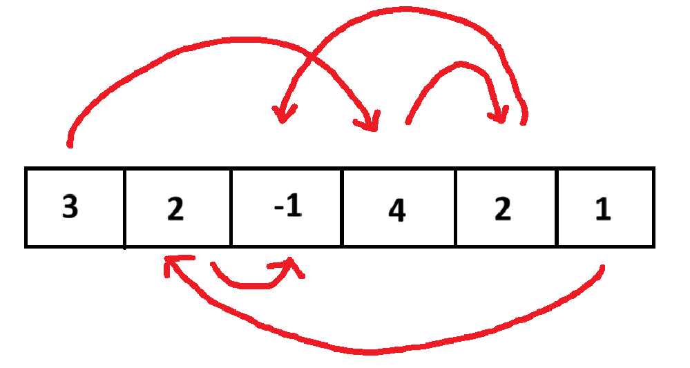

---


# Convegno aziendale

[https://training.olinfo.it/task/mat_convegno](https://training.olinfo.it/task/mat_convegno)

Abbiamo una lista di dipendenti. Ogni dipendente ha come capo un altro. Un dipendente e' sottoposto di un altro se seguendo la gerarchia dal primo saliamo fino al secondo.

Vogliamo trovare tutte le coppie possibili di capo - sottoposto (anche di livelli molto diversi).

---

# Brute Force

Iniziamo calcolando tutte le soluzioni possibili. Per ogni coppia di dipendenti `i,j` devo testare che `j` sia un sottoposto di `i`, quindi salgo la catena di `j` finche' non arrivo a `i` oppure `-1` (il codice del direttore).

Con questa soluzione da scrivere velocemente (e senza pensarci troppo), otteniamo gia' 35 punti!

---

# Brute Force

```c++
int result = 0;
for (int i = 0; i < N; i++) {
    for (int j = 0; j < N; j++) {
        if (i != j) {
            int current = j;
            while (current != -1 && current != i) {
                current = C[current];
            }
            if (current == i) result++;
        }
    }
}
return result;
```

---


# Greedy 1

Mentre un nostro compagno scrivera' la versione di sopra velocemente, pensiamo una soluzione migliore.

Immaginiamo di ripercorre il percorso da ciascun impiegato `i` al capo. Questo vuol dire che tutti i membri `j` dell'azienda che "stanno davanti" a lui possono formare una possibile coppia con lui stesso (`i`, `j`). 

---



---

# Balzi

Partendo da ogni membro dell'azienda, uno alla volta, proviamo a risalre al suo capo. Ogni volta che facciamo un "balzo" vorrà dire che avremo una possibile coppia in più per il convegno.

```c++
  int res, step = 0;
  for (int i = 0; i < N; i++){
      int j = i;
      while (C[j] != -1 && j < N){
          step++;
          j = C[j];            //faccio il balzo
      }
      ...
  }
```

---

# Analisi

Quando arriviamo al capo abbiamo ottenuto quindi il numero con cui il dipendente `i` può fare coppia. Non ci resta quindi che aggiungere questo numero al risultato e resettare il numero di "balzi"

```c++
if (C[j] == -1){
          res += step;
      }
      step = 0;
```

---

# Risultato

```c++
return res;
```

In res otterremo quindi il numero di coppie possibili.

Con questo algoritmo otteniamo solo 65 però. Perchè? Come possiamo migliorare? Qual è il problema legato a questo algoritmo?


---

# Programmazione dinamica

Dovremmo cercare di tenere a mente i membri dell'azienda che abbiamo già contato. <br>Perchè partendo dall'impiegato `i` passo per l'impiegato `j` e poi quando parto da `j` devo ricalcolare le stesse cose che avevo già fatto?

Questo lo vedremo meglio nella prossima lezione in cui introdurremo la programmazione dinamica!

---

# Greedy 2

Ora proviamo a risolvere questo problema con la tecnica greedy, migliorando però il 65 di prima.

Immaginiamoci l'organigramma dell'azienda: al direttore sono collegati tutti i sottoposti diretti, poi ognuno ha i suoi sottoposti, e cosi' via. E' come se fosse un albero genealogico: infatti, questa struttura dati si chiama `albero`, e vedremo in futuro verra' usata per tanti problemi.

---


---

# Albero

Salviamo per ogni dipendente un array di tutti i sottoposti diretti (quindi un `vector` di `vector`).

```c++
vector<vector<int>> diretti(N);
int direttore = -1;

for (int i = 0; i < N; i++) {
    if (C[i] == -1) {
        direttore = i;
    } else {
        diretti[C[i]].push_back(i);
    }
}
```

---

# Analisi

Scendiamo dal direttore in basso, e contiamo per ogni dipendente quanti sottoposti totali abbia ognuno

```c++
void dfs(int partenza,
    const vector<vector<int>> &diretti,
    vector<int> &sottoposti) {
    for (int dipendente : diretti[partenza]) {
        dfs(dipendente, diretti, sottoposti);
        sottoposti[partenza] += sottoposti[dipendente] + 1;
    }
}

vector<int> sottoposti(N, 0);
dfs(direttore, diretti, subordinates);
```

---

# Analisi

Vedete che usiamo una funzione ricorsiva? Preso un dipendente di partenza, chiamiamo per ogni suo sottoposto la funzione `dfs` (che ci da' a loro volta il numero di sottoposti che loro hanno), dopodiche'li aggiungiamo al numero di sottoposti del dipendente di partenza.

Il nome `dfs` significa _Depth First Search_: cerchiamo in profondita' l'albero, prendendo ogni volta un ramo e scendendo fino in fondo prima di cambiare ramo.

Vedremo tra qualche lezione cosa possiamo farci con questa conoscenza!

---

# Risultato

```c++
int result = 0;
for (int i = 0; i < N; i++) {
    result += subordinates[i];
}
return result;
```

Il risultato finale di coppie possibili sara' la somma di tutti i sottoposti che ogni dipendente ha.

Con questa soluzione raggiungiamo il 100%!
