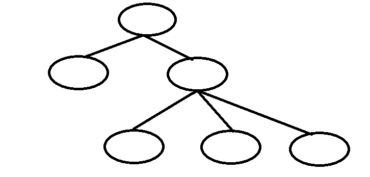

---

# Convegno Aziendale

### Testo

source: https://training.olinfo.it/task/mat_convegno

---

### Inziamo

Per inziare pensiamo a un algoritmo brute force, ovvero le tentiamo tutte!

---

### Idea Brute Force

Prendo ogni singolo impiegato e controllo con ogni altro impiegato se è un suo sottoposto. In caso affermativo conto la coppia e la aggiungo alla somma totale

---

### Risultato

Questo algoritmo è molto dispendioso --> costo O(N^2)

Possiamo fare meglio?

---

### Idea Greedy

Essendo una struttura gerarchica, se usassimo un albero?

Il nodo radice rappresenta il capo e ogni figlio il rispettivo sottoposto
Quante coppie sono possibili in questo scenario?

